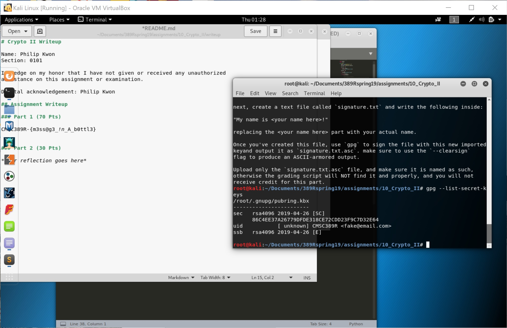

# Crypto II Writeup

Name: Philip Kwon
Section: 0101

I pledge on my honor that I have not given or received any unauthorized
assistance on this assignment or examination.

Digital acknowledgement: Philip Kwon

## Assignment Writeup

### Part 1 (70 Pts)

CMSC389R-{m3ss@g3_!n_A_b0ttl3}

### Part 2 (30 Pts)

cbc.bmp

ecb.bmp

1. I notice that both pictures look grainy and like static. The cbc.bmp looks completely like static. The ecb.bmp still allows me to see the general outline of the original image through the static. Also, the static of ecb.bmp looks patterned, unlike the random static of cbc.bmp.

2. The ECB block cipher mode is less secure. ECB encrypts identical plaintext blocks into identical ciphertext blocks. As a result, it does not hide data patterns well. In CBC, each block of plaintext is XORed with the previous ciphertext block before being encrypted. This way, each ciphertext block depends on all the plaintext blocks processed up to that point, which results in a more secure encryption compared to ECB.
